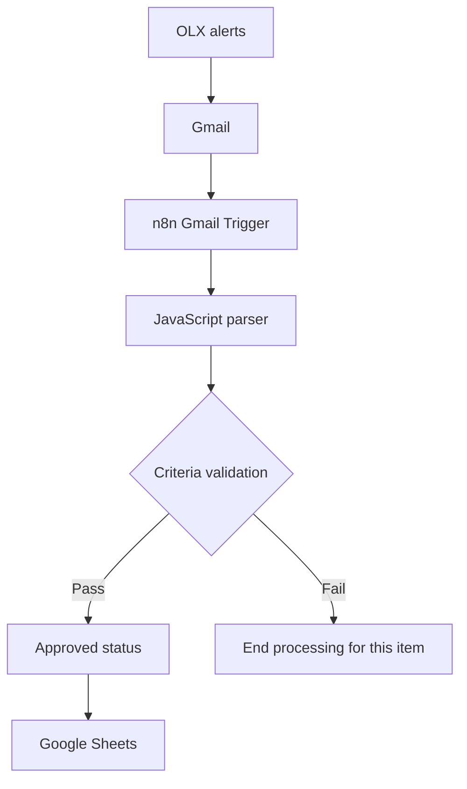

# AI Rental Scout — V2

**Turning rental alerts into a structured property shortlist with n8n and JavaScript.**

AI Rental Scout processes OLX listing alerts received through Gmail, extracts property data, applies price and bedroom criteria, and maintains a Google Sheets shortlist with URL-based deduplication.

Built as a Business & AI automation portfolio project, it demonstrates how to translate a recurring manual task into an integrated workflow with clear business rules.

> **Implementation scope:** V2 uses deterministic JavaScript parsing and rule-based qualification. It does not currently use an LLM or an AI agent. AI-assisted enrichment is a future improvement.

## The Problem

Searching for rental properties involves repeatedly opening alerts, reviewing listings, checking requirements, and copying relevant information into a spreadsheet.

This process creates three practical challenges:

- Relevant information is scattered across email alerts.
- Properties must be checked against the same criteria repeatedly.
- Repeated alerts can create duplicate spreadsheet records.

The goal was to turn incoming alerts into a consistent shortlist for human review.

## The Solution

The workflow connects email ingestion, data extraction, qualification, and storage.

Listings that meet the configured criteria receive an approved status and are saved to Google Sheets. When the same tracking URL is processed again, the existing row is updated instead of creating another record.

This pattern also applies to business workflows such as inbound lead qualification and market monitoring: capture a signal, structure the information, apply rules, and update an operational record.

## Architecture



The Google Sheets step uses **Append or Update Row**, matching records by `url_rastreamento`.

The Gmail Trigger periodically checks for matching messages. The workflow runs on **n8n Cloud**, so it does not require a local computer or browser to remain open.

## Technology Stack

| Technology | Role |
| --- | --- |
| OLX email alerts | Source of rental listing information |
| Gmail | Receives the alerts |
| n8n Cloud | Orchestrates the workflow and checks for new messages |
| JavaScript | Parses email content into structured listing records |
| n8n conditional and field-assignment nodes | Apply qualification rules and approved status |
| Google Sheets | Stores the shortlist and updates existing records |

## How It Works

1. **Receive:** OLX sends a rental alert to Gmail.
2. **Detect:** The Gmail Trigger identifies a message matching the configured filters.
3. **Parse:** A JavaScript Code node extracts individual listings and structures the available property information.
4. **Validate:** Each listing is checked against the price and bedroom criteria.
5. **Approve:** Listings that meet both conditions receive an approved status. Items that fail stop at validation.
6. **Store:** Google Sheets appends a new row or updates an existing row using `url_rastreamento` as the matching key.

### Current Qualification Rules

Both conditions must be true:

```text
preco <= 2000 AND quartos >= 2
```

| Field | Meaning | Requirement |
| --- | --- | --- |
| `preco` | Advertised rental price in Brazilian reais | At most R$2,000 |
| `quartos` | Number of bedrooms | At least 2 |

These criteria evaluate the advertised fields. They do not verify availability, listing legitimacy, or total occupancy costs such as condominium fees and taxes.

### Deduplication

The Google Sheets node uses **Append or Update Row**, configured to match on `url_rastreamento`:

- **Matching URL found:** update the existing row.
- **No matching URL found:** append a new row.

This prevents duplicates when an identical tracking URL is processed again.

**Boundary:** different tracking URLs may point to the same listing. The current implementation therefore provides deduplication by tracking URL, rather than guaranteed uniqueness by property. A canonical listing URL or stable listing ID would provide a stronger matching key.

## Validation and Current Status

V2 was tested with alerts containing listings from:

- **Florianópolis, Santa Catarina, Brazil**
- **Imbituba, Santa Catarina, Brazil**

During development:

- One recorded execution extracted **6 listings**, with **5 passing** the configured criteria.
- Reprocessing the same input did not increase the spreadsheet row count, validating deduplication for the tracking URLs used in that test.
- Temporary test nodes were removed.
- The final workflow was published on n8n Cloud as **V2 Final - Production**.

These checks demonstrate the tested workflow behavior. Long-term unattended reliability, parsing accuracy across all email formats, and quantified time savings have not yet been measured.

## Design Decisions

| Decision | Rationale |
| --- | --- |
| Use email alerts as the entry point | Build on information already delivered to the inbox |
| Use explicit qualification rules | Keep decisions transparent and easy to adjust |
| Use JavaScript for parsing | Transform email content within the workflow |
| Store results in Google Sheets | Provide a familiar interface for reviewing the shortlist |
| Match records by tracking URL | Use an available identifier to handle repeated processing |
| Keep the architecture small | Make the workflow easier to understand, maintain, and extend |

## Known Limitations

- **Missing property type:** `tipo_imovel` is sometimes `null`.
- **Incomplete neighborhood extraction:** the neighborhood is not extracted for some Imbituba listings.
- **Tracking links:** the workflow stores tracking URLs rather than final listing URLs.
- **Email-format dependency:** changes to the alert template may affect extraction.
- **Limited test coverage:** validation covered the two cities above, not every possible OLX email format.
- **No separate review queue:** items that fail qualification stop at the validation step.

## Workflow Export and Setup

The original n8n workflow export is **not included in this repository yet**. This repository currently documents the implementation; it does not yet provide an importable workflow.

The intended location for the reviewed export is:

```text
workflows/ai-rental-scout-v2.json
```

### Adding the Workflow Safely

1. Export the original V2 workflow from n8n and keep the raw export outside the repository.
2. Create a separate copy for publication.
3. Remove credential references, tokens, personal email addresses, spreadsheet identifiers, instance-specific metadata, and private configuration.
4. Remove pinned data, captured email content, execution samples, real listing links, and tracking URLs. Inspect Code nodes, expressions, filters, and notes as well.
5. Replace environment-specific values with clear placeholders while preserving the original parser, rules, and connections.
6. Keep the public copy inactive and test its import in a separate workflow.
7. Add the reviewed file at the path above and update this section with the tested n8n version and setup details.

### Requirements for Reproduction

Once the sanitized workflow is available, reproduction will require:

- An n8n environment.
- Your own Gmail and Google Sheets connections.
- OLX rental alerts delivered to your inbox.
- A destination sheet with columns matching the workflow mappings.
- `url_rastreamento` configured as the matching column.
- Both qualification rules configured with **AND** logic.

Before enabling automatic execution, test an approved listing, a rejected listing, and a repeated matching key in a separate test sheet. Then verify a subsequent automatic execution.

## Future Improvements

- Improve property-type and neighborhood extraction.
- Resolve canonical listing URLs or stable listing IDs.
- Add explicit handling for missing or invalid prices, bedroom counts, and matching keys.
- Create synthetic parsing fixtures and regression tests for different email formats.
- Add failure notifications and execution monitoring.
- Introduce a review queue for incomplete records.
- Measure processing volume, extraction completeness, duplicate frequency, and review time saved.
- Evaluate AI-assisted extraction or enrichment for ambiguous text, with schema validation, cost controls, and human review.

## Business & Automation Skills Demonstrated

- Translating a practical need into explicit business rules.
- Connecting multiple services in an operational workflow.
- Transforming email content into structured data.
- Applying conditional processing and record updates.
- Testing repeated-input behavior.
- Documenting implementation boundaries and prioritizing improvements.

## Privacy

Public project files must not contain credentials, tokens, personal email addresses, real email content, spreadsheet identifiers, or live tracking URLs.

Examples and test fixtures should use synthetic data. Authentication and private configuration belong in the user's own n8n environment.
